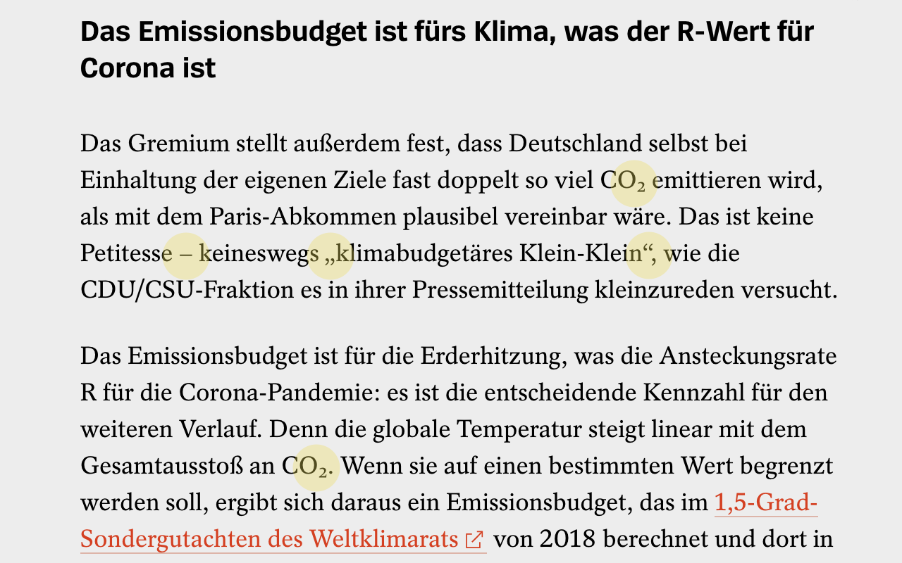

# SmartTypography

Browser extension for smart quotes and other typographic niceties.

Does the use of dumb quotation marks, and hyphens instead of en dashes slow down your reading speed? Then you may be typographically aware. Don’t despair, install this extension, and beautiful proper quotation marks and dashes will be applied automatically to any website you read.

## Features

* Smart quotes for German and English text
* En-dashes instead of hyphens
* Subscript numerals for CO₂ and H₂O
